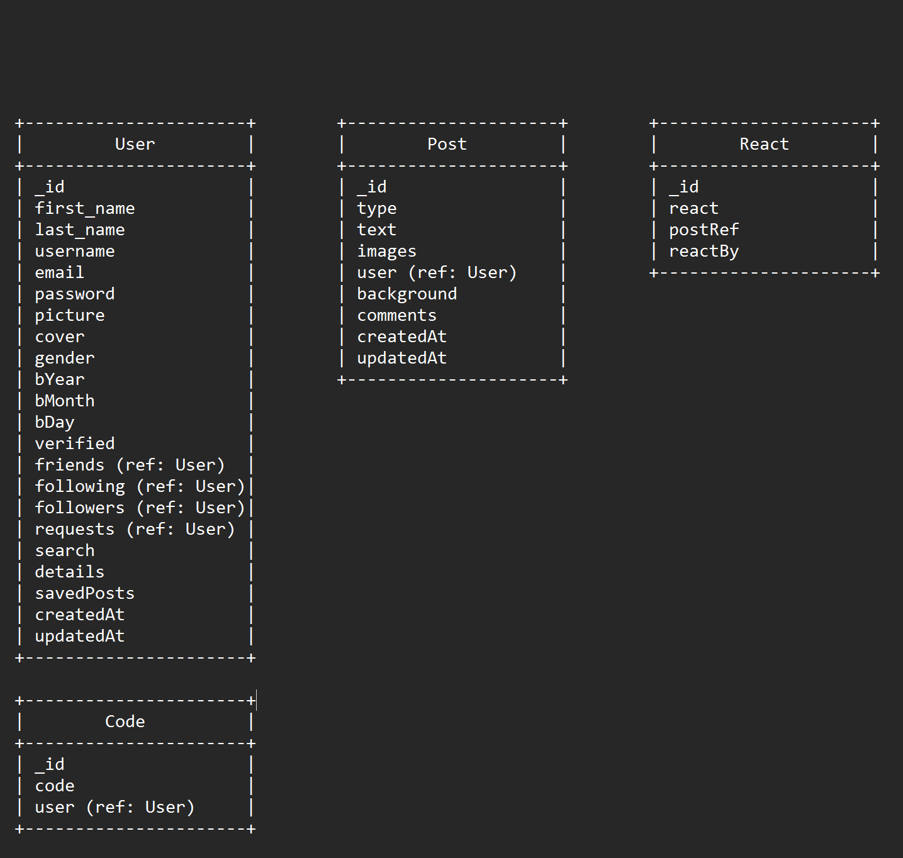

# SnapBook

Tech Stack Used:

`For Frontend -` HTML, CSS, JavaScript, React.js

`For Backend -` Node.js, Express.js

`Database -` MongoDB

• SnapBook a social media platform for real‑time microblogging and communication. It enables users to share their thoughts, which can include text, images, links, and gifs.

• Users can personalize their profiles with Bio and curated galleries.

• Users can socialize with each other through the features of friends and followers.

• Users can also express their opinions through comments and reactions.

• Cloudinary is used to store the uploaded images seamlessly.

## Entity Relationship Diagram:



`User Entity Relationships:`

- One-to-Many Relationship:

  - User has many Post entities (via fields savedPosts).
  - User has many React entities (via fields friends, following, followers, requests).

- Many-to-Many Relationship:
  - User can have many User entities as friends (via field friends), and a User can be a friend to many other User entities.

`Post Entity Relationships:`

- Many-to-One Relationship:

  - Posts belongs to one User (via field user).

- One-to-Many Relationship:
  - Post can have many React entities (via field comments).

`React Entity Relationships:`

- Many-to-One Relationships:
  - React belongs to one User (via field reactBy).
  - React belongs to one Post (via field postRef).

## Installation

Install my-project with npm

For Backend:

```bash
$ cd backend   // go to server folder
$ npm i       // npm install packages
$ npm run server // run it locally
```

For Frontend:

```bash
$ cd frontend   // go to client folder
$ npm i       // npm install packages
$ npm start // run it locally
$ npm run build // this will build the server code to es5 js codes and generate a dist file
```

## Environment Variables

To run this project, you will need to add the following environment variables to your .env file

`DATABASE_URL` MongoDB Database URL

`BASE_URL` Frontend URL

`EMAIL` Company mail id

`TOKEN_SECRET` JWT Secret

Cloudinary Variables for Profile Picture Storage
`CLOUD_NAME`
`CLOUD_API_KEY`
`CLOUD_API_SECRET`

Stripe Variable
`STRIPE_SECRET_KEY`

For Frontend:
`REACT_APP_BACKEND_URL` Backend URL

## Deployment

- Backend is deployed on `Render`.

- Frontend is deployed on `Netlify`.

## DEMO VIDEO

Hosted link :
https://snap-book.netlify.app/
